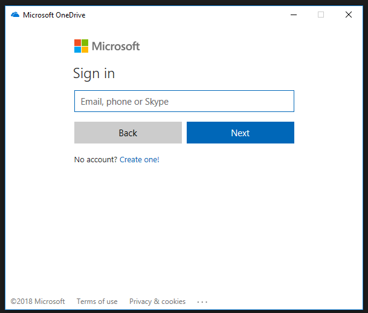

My [new job](https://www.uclan.ac.uk) came with a surprise: I get a Surface Pro with docking station as my work PC.  This is actually very nice (I tend normally towards the "good enough" school of technology ownership).  An Office365 subscription also comes with the job, and so 1TB (yes, a few years ago, a good hard-disk) of cloud storage from [OneDrive for business](https://products.office.com/en-gb/onedrive-for-business/online-cloud-storage).

Hmm, but... The Surface Pro only have GBs of free storage (thanks to a smallish SSD) and that's to be shared with applications I might want to install.  But, surely, I can just sync the folders I want, and keep more in the cloud (swapping things about, perhaps, if needs be).  Right?  A bit of Internet searching suggests that, sure, that's an option.  For normal consumer OneDrive.  But not, it seems, for OneDrive Business.  Until maybe mid-2018 when a new client comes out.  YMMV of course.

I _did_ find some instructions and downloads which can turn on hidden features in the consumer version of OneDrive (which you'll have automatically, if you are on Windows 10).  Am I going to run random registry hacks on my new work PC?  No...  But it turns out the edits you need to mark are small, and easily reversible, and safe seeming.  So here's a guide.

### The default view

If you fire up OneDrive, it'll look a bit like this:

But you won't be able to input a work email.

### Edit the registry

Hit the windows key, and type `regedit` and enter to tune the "Registry Editor".  You'll need some form of admin rights, I'm afraid.  In the tree view on the left, navigate to, sucessively, "HKEY_CURRENT_USER" then "Software" then "Microsoft" and then "OneDrive".  Now:

- Right-click in the right-hand window, select "new" and then "DWORD (32-bit) value".
- Type the new name as "EnableAddAccounts".
- Double-click on the new entry, and change the "Value data" to 1.
- Do exactly the same with a new entry with name "DefaultToBusinessFRE" (and value 1).

Close the registry editor

### The new view

Initially, I this didn't work me.  I quit, and restarted, OneDrive, but no luck.

- You could try rebooting your machine.  (I didn't, thanks to some long-running computational tasks I'm performing...)
- However, if you visit the [OneDrive Download](https://onedrive.live.com/about/en-GB/download/) site, and click on "Start OneDrive", a new view of OneDrive will open, where I was able to type my work email address, and then was taken to my work's login page.  After that, I can selectively sync the folders I want.
